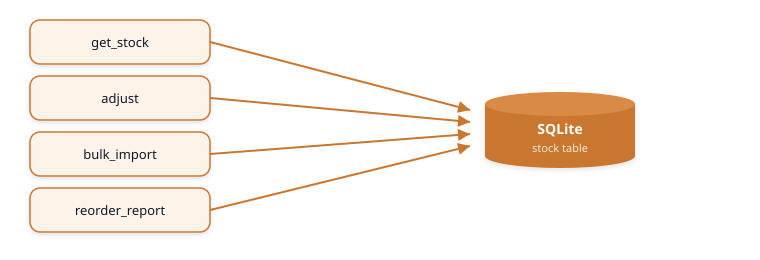
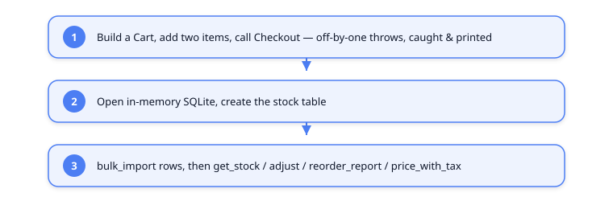

# Vue d'ensemble de la solution — Kit de démo Copilot GH-300 (.NET 8)

Ce document explique ce qu'est la solution, comment ses éléments s'articulent et où se
trouvent les **défauts intentionnels**. L'ensemble du kit existe pour donner à GitHub Copilot un vrai
travail à accomplir pendant les démos (`/fix`, `/tests`, revue, refactorisation, modernisation).

---

## 1. La vue d'ensemble

Il y a trois projets sources et un projet de test. `DemoApp` est le point d'entrée ;
il pilote les deux modules de bibliothèque « imparfaits » afin que leurs bogues plantés apparaissent à l'exécution.


| Projet | Fichier | Responsabilité |
| --- | --- | --- |
| `DemoApp` | `Program.cs` | Pilote console qui exécute les deux modules de bout en bout |
| `ShoppingCart` | `Cart.cs` | Totaux du panier, remise, paiement |
| `InventoryLegacy` | `InventoryLegacy.cs` | Lecture/ajustement/rapport de stock adossé à SQLite |
| `ShoppingCart.Tests` | `UnitTest1.cs` | Couverture de test volontairement minimale |

---

## 2. Module ShoppingCart

Le panier contient une liste d'articles (prix + quantité) et une remise. Le paiement calcule un
total remisé et renvoie une commande.


**Défauts plantés (volontairement) :**

- **Bogue de décalage d'un cran** — `Subtotal` boucle sur `i <= Items.Count`, il lit donc un cran au-delà de
  la fin de la liste et lève une `ArgumentOutOfRangeException`.
- **Numéro de carte divulgué** — `Checkout` écrit `user.CardNumber` dans la console.
- **Monnaie en `double`** — les prix devraient être des centimes entiers, pas des flottants.
- **Documentation XML manquante** sur les membres publics.

`DemoApp` enveloppe `Checkout` dans un `try/catch` afin que le décalage d'un cran apparaîsse comme une
exception *capturée* au lieu de faire planter la démonstration.

---

## 3. Module InventoryLegacy

Un inventaire adossé à SQLite dans un style volontairement daté — sans documentation, sans types sur certaines
entrées, et avec du SQL construit par chaînes.



**Défauts plantés (volontairement) :**

- **Injection SQL** — `get_stock`, `adjust` et `bulk_import` construisent le SQL par
  concaténation de chaînes / `string.Format` au lieu d'utiliser `SqliteParameter`.
- **Aucune documentation XML**, nommage daté (`get_stock`, `c`, `r`, `n`).
- **Monnaie en `double`** dans `price_with_tax`.

La table `stock` comporte trois colonnes : `sku`, `qty`, `reorder_point`.

---

## 4. Flux d'exécution (ce qui se passe lors de `dotnet run`)



---

## 5. Comment compiler et exécuter

```powershell
dotnet build
dotnet run --project src/DemoApp
dotnet test
```

---

## 6. Aide-mémoire des défauts (cibles de démo Copilot)

| Où | Défaut | Le corriger avec |
| --- | --- | --- |
| `Cart.Subtotal` | Décalage d'un cran (`<=`) | `/fix`, chat en ligne |
| `Cart.Checkout` | Journalise le numéro de carte | Revue de sécurité |
| `Cart` / `CartItem` | Monnaie en `double` | Copilot Edits (centimes) |
| `InventoryLegacy` | Injection SQL | Refactoriser vers `SqliteParameter` |
| les deux modules | Documentation XML manquante | `/doc`, moderniser |
| `ShoppingCart.Tests` | Presque aucun test | `/tests`, mode agent |

> Chaque problème ci-dessus est intentionnel — le kit est un terrain d'entraînement, pas du code de production.
